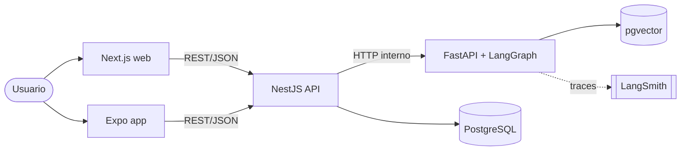
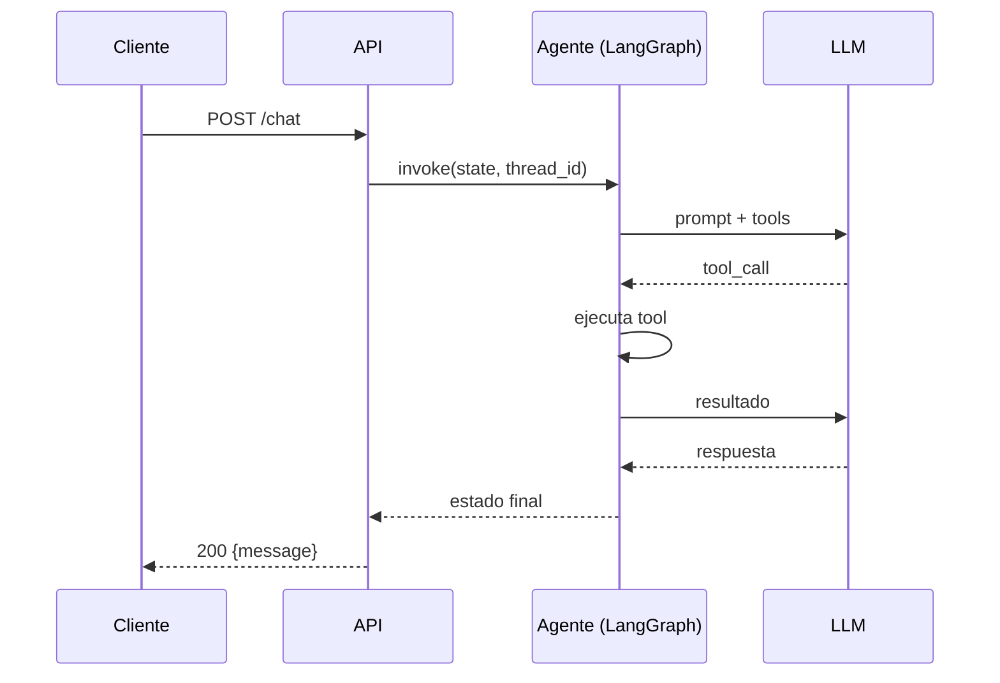
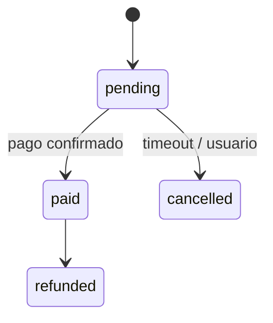

# Diagramas con Mermaid

Mermaid se renderiza en GitHub, GitLab y la mayoría de visores markdown. Mantén los diagramas junto a la doc que explican.

## Contexto / contenedores (estilo C4 simplificado)

## Secuencia

## Estado

## Reglas

- Un diagrama = una pregunta ("¿quién habla con quién?", "¿en qué orden?").
- Nombres iguales a los del código.
- Máximo ~12 nodos; si hay más, divide por nivel.
